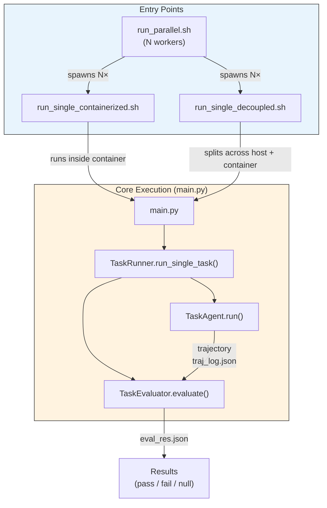
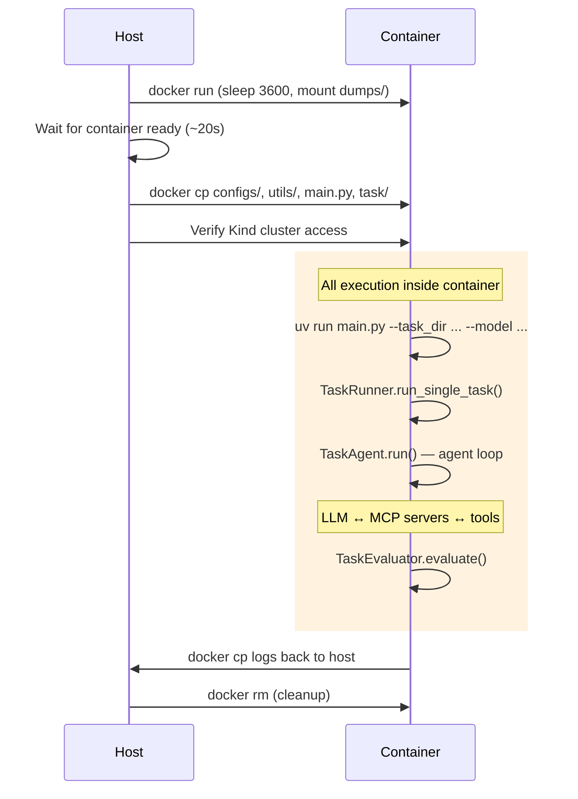
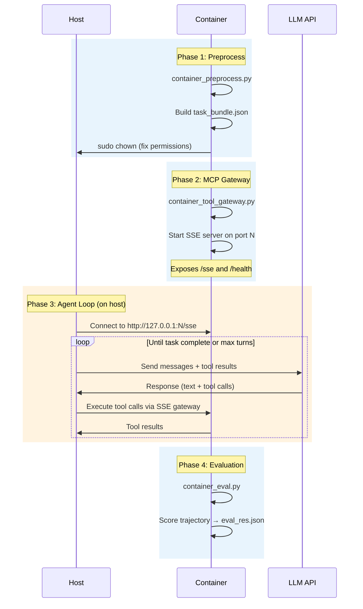
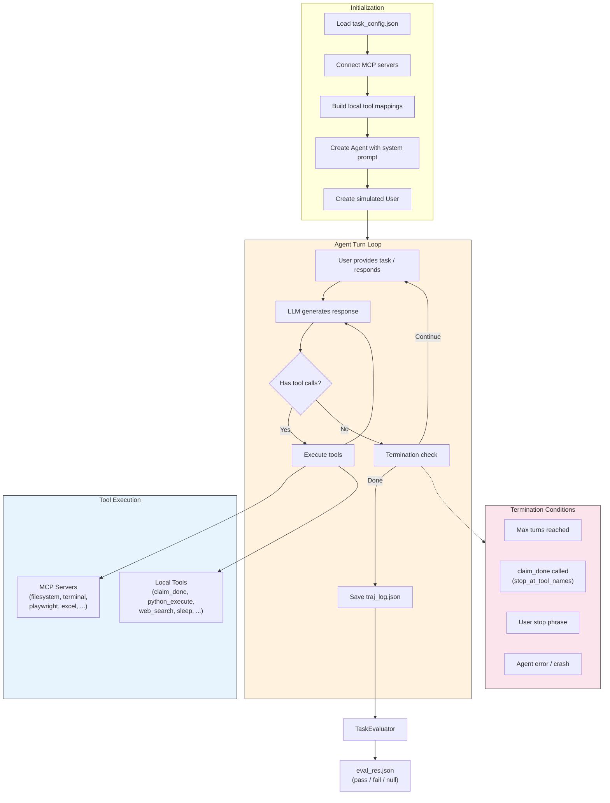
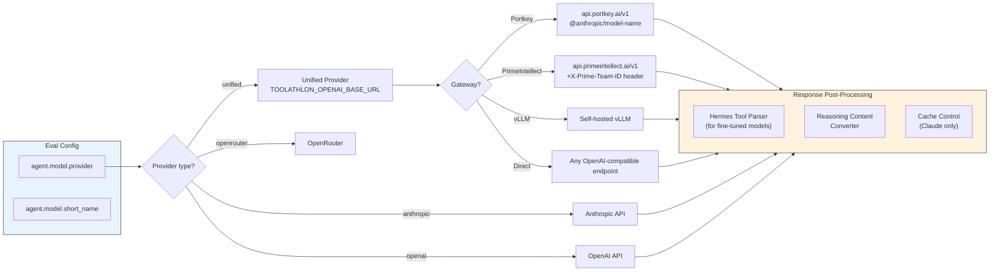

# Toolathlon Architecture

Visual reference for how the benchmark system is structured. All diagrams use Mermaid syntax and render on GitHub.

---

## 1. High-Level System Overview

Three ways to run tasks — all converge on the same core: `main.py` → `TaskRunner` → `TaskAgent` → `Evaluator`.



**When to use which:**
| Runner | Agent runs on | Use when |
|--------|--------------|----------|
| Containerized | Inside container | Default; no host code changes needed |
| Decoupled | Host | You've modified agent code (API compat fixes, model provider) |
| Parallel | Either (configurable) | Full evaluation run across all tasks |

---

## 2. Containerized Runner Flow

Everything runs inside a single Docker container. Simplest mode — no network gateway needed.



**Key files:**
- `scripts/run_single_containerized.sh` — orchestrates container lifecycle
- `main.py` → `utils/task_runner/runner.py` → `utils/roles/task_agent.py`

---

## 3. Decoupled Runner Flow

Container handles preprocessing, MCP tools, and evaluation. Agent loop runs on the host — so host-side code changes (API fixes, model provider) take effect without rebuilding the image.



**Key files:**
- `scripts/run_single_decoupled.sh` — orchestrates the 4 phases
- `scripts/decoupled/container_preprocess.py` — builds `task_bundle.json`
- `scripts/decoupled/container_tool_gateway.py` — SSE gateway for MCP tools
- `scripts/decoupled/host_agent_loop.py` — agent loop (OpenAI Agents SDK)
- `scripts/decoupled/host_agent_loop_claude_sdk.py` — agent loop (Claude Agent SDK)
- `scripts/decoupled/container_eval.py` — evaluation

---

## 4. Agent Loop & MCP Architecture

Inside `TaskAgent.run()` — the core loop that drives task execution.



**MCP server config:** Each task declares needed servers in `task_config.json`. The `MCPServerManager` (`utils/mcp/tool_servers.py`) reads YAML configs from `configs/mcp_servers/` and starts the required servers.

**Example task_config.json:**
```json
{
  "needed_mcp_servers": ["yahoo-finance", "filesystem", "terminal", "playwright_with_chunk"],
  "needed_local_tools": ["claim_done", "python_execute", "web_search"]
}
```

---

## 5. Model Provider Routing

How `build_agent_model_provider()` routes LLM requests to different backends.



**Key env vars:**
| Variable | Purpose |
|----------|---------|
| `TOOLATHLON_OPENAI_BASE_URL` | API endpoint for the unified provider |
| `TOOLATHLON_OPENAI_API_KEY` | API key (or gateway key for Portkey) |
| `TOOLATHLON_OPENAI_EXTRA_HEADERS` | JSON string of extra HTTP headers |

**Post-processing pipeline** (`utils/api_model/model_provider.py`):
1. **Hermes parser** — converts `<tool_call>` XML tags to native `tool_calls` (fine-tuned models)
2. **Reasoning converter** — extracts reasoning content from various model formats
3. **Cache control** — adds `cache_control` annotations for Claude prompt caching (skips empty content)
