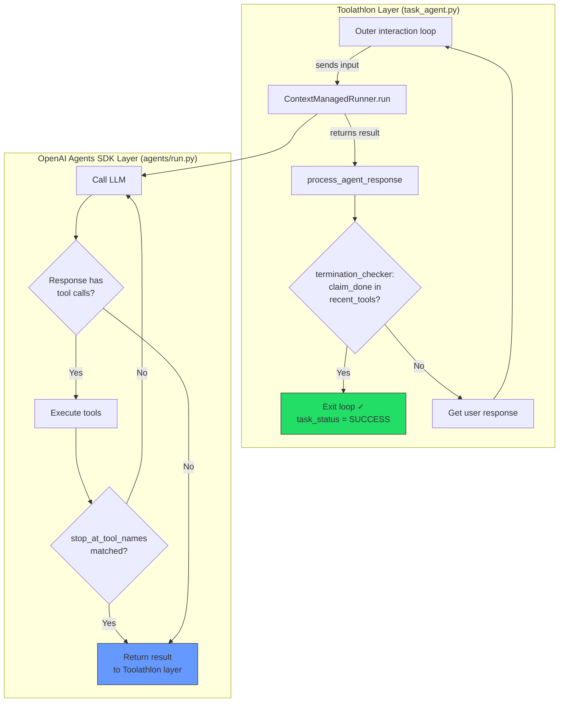
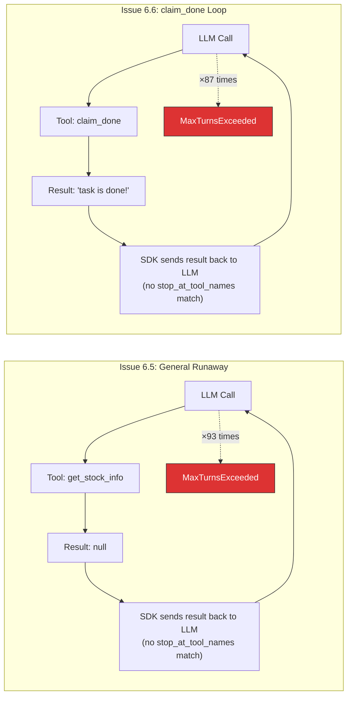
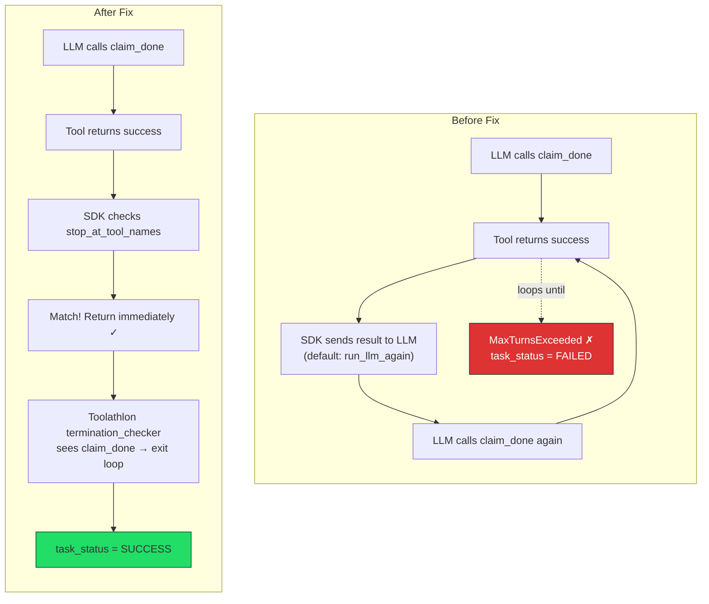
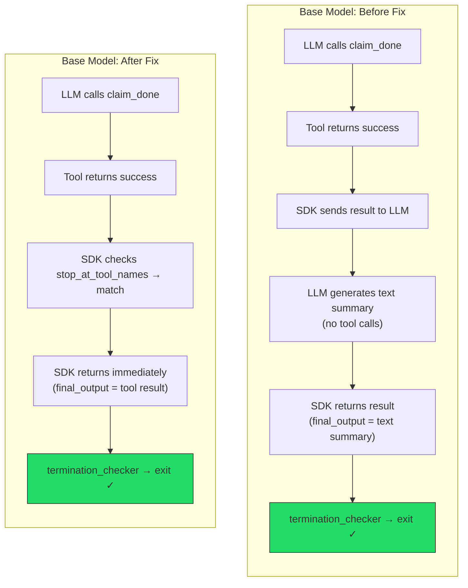

# Toolathlon Evaluation Results

Date: 2026-03-18

## 1. Executive Summary

[Toolathlon](https://toolathlon.xyz/) is a benchmark for evaluating language agents on 600+ diverse, long-horizon tool-use tasks in realistic environments (Canvas LMS, email, Snowflake, Kubernetes, Google Workspace, etc.). We evaluated three model configurations on a 78-task subset, excluding Google Workspace tasks which are not yet configured.

### Results at a Glance

| Model | Pass | Fail | Inconclusive | Infra Fail | Pass Rate |
|-------|------|------|--------------|------------|-----------|
| Claude Opus 4.6 (Run 1, containerized) | 39 | 36 | 3 | 0 | **50.0%** (39/78) |
| Claude Opus 4.6 (Run 2, decoupled) | 37 | 39 | 0 | 0 | **48.7%** (37/76) |
| Qwen3-30B Instruct (base) | 3 | 62 | 10 | 3 | **3.8%** (3/78) |
| Qwen3-30B Instruct (fine-tuned, Run 2) | 3 | 41 | 33 | 1 | **3.9%** (3/77) |

Pass rate treats inconclusive and infra failures as failures. Opus Run 2 evaluated 76/78 tasks (2 missing: `ab-testing`, `experiments-recordings`).

**Key findings:**
- Claude Opus dramatically outperforms Qwen3-30B on long-horizon agentic tasks (48-50% vs 3-4%).
- Opus results are stable across runs: 50.0% vs 48.7%, with 12 tasks flipping between runs (see Section 5.2).
- All Opus failures are "agent completed, eval failed" — zero crashes or inconclusives in Run 2.

---

## 2. Setup & Infrastructure

### Deployed Services

All services run in Docker containers on a single Ubuntu Linux host (30GB RAM, 8 CPUs), managed by `global_preparation/deploy_containers.sh`:

| Service | Container | Port | Purpose |
|---------|-----------|------|---------|
| Canvas LMS | `canvas-docker-inst-alpha` | 10001 | Course management tasks |
| Email (Poste.io) | `poste-inst-alpha` | 10005 | Email sending/reading tasks |
| WooCommerce | `woo-wp-inst-alpha` | 10003 | E-commerce tasks |
| Kubernetes | 5 Kind clusters | — | K8s deployment/management tasks |

**Task image:** `lockon0927/toolathlon-task-image:1016beta` — contains the agent framework, MCP servers, and task definitions.

### Not Configured

**Google Workspace** (Drive, Sheets, Gmail, Calendar) credentials are not set up. This excludes 31 tasks from the full 109-task pool, leaving 78 tasks in `scripts/google_free_tasks.txt`.

---

## 3. Models Evaluated

### Claude Opus 4.6 (Run 1 — Containerized)

| Setting | Value |
|---------|-------|
| Provider | `unified` (OpenAI-compatible) |
| Endpoint | `https://api.anthropic.com/v1` |
| Config file | `scripts/formal_run_v0.json` |
| Runner | **Containerized** — agent loop runs inside the task container |
| `max_tokens` | 4096 |
| Extra headers | None |

### Claude Opus 4.6 (Run 2 — Decoupled, Portkey)

| Setting | Value |
|---------|-------|
| Provider | `unified` via Portkey gateway |
| Endpoint | `https://api.portkey.ai/v1` |
| Model name | `@anthropic/claude-opus-4-6` |
| Config file | `scripts/formal_run_v0.json` |
| Runner | **Decoupled** — agent loop on host, task env in container |
| `max_tokens` | 4096 |
| Auth | `x-portkey-api-key` header (Portkey routes to Anthropic backend) |
| Note | cache_control bug ([Issue 13](known_issues.md#issue-13-cache_control-cannot-be-set-for-empty-text-blocks-anthropic-api)) hit 11 tasks mid-run; fixed and those tasks were rerun |

### Qwen3-30B-A3B-Instruct-2507 (base)

| Setting | Value |
|---------|-------|
| Provider | `unified` |
| Endpoint | `https://api.pinference.ai/api/v1` (PrimeIntellect, vLLM-backed) |
| Config file | `scripts/qwen3_run.json` |
| Runner | **Decoupled** — agent loop runs on host, task env in container |
| `max_tokens` | 8192 |
| Thinking mode | Disabled (`chat_template_kwargs.enable_thinking: false`) |
| Extra headers | `X-Prime-Team-ID` via `TOOLATHLON_OPENAI_EXTRA_HEADERS` |
| Tool call format | Native `tool_calls` API field |

### Qwen3-30B-A3B-Instruct-2507 (fine-tuned)

| Setting | Value |
|---------|-------|
| Model ID | `Qwen/Qwen3-30B-A3B-Instruct-2507:n66oroaewm5aekfqvi6846i9` |
| Config file | `scripts/qwen3_ft_run.json` |
| Runner | **Decoupled** |
| Tool call format | **Hermes `<tool_call>` tags in content** (not native `tool_calls`) |
| Status | Completed |

The fine-tuned model outputs tool calls as XML tags in the message content rather than using the native API `tool_calls` field:

```
Base instruct:  content=None,   tool_calls=[{name: "get_weather", arguments: {...}}]
Fine-tuned:     content="<tool_call>\n{\"name\": \"get_weather\", ...}\n</tool_call>",  tool_calls=None
```

This is handled transparently by `utils/api_model/hermes_tool_parser.py` (see Section 6).

---

## 4. Methodology

### Task Selection

78 tasks from `scripts/google_free_tasks.txt`, spanning: Canvas LMS, email, Excel, Git, GitHub, HuggingFace, Kubernetes, Notion, WandB, WooCommerce, web scraping, file manipulation, and more.

### Eval Configuration

| Parameter | Value |
|-----------|-------|
| `max_turns` | 50 (agent-user interaction turns) |
| `max_steps_under_single_turn_mode` | 200 |
| `max_inner_steps` | 100 (tool calls per agent turn) |
| Simulated user model | GPT-5 via aihubmix |
| Workers (parallel tasks) | 6 |

### Runner Types

| Runner | How it works | When to use |
|--------|-------------|-------------|
| **Containerized** | Agent loop + task env co-located in Docker | Default; no host code changes needed |
| **Decoupled** | Container handles preprocess + eval + MCP gateway; agent loop runs on host via SSE | When host-side code changes are needed (e.g. API compatibility fixes) |

We used the containerized runner for Opus Run 1, the decoupled runner for Opus Run 2 (to pick up the cache_control fix) and for all Qwen runs (required for the 422 fix and hermes parser — see Section 6).

### Scoring

| `pass` value | Meaning | Counted as |
|-------------|---------|------------|
| `true` | Task completed, evaluation passed | Pass |
| `false` | Task completed, evaluation failed | Fail |
| `null` | Agent didn't reach SUCCESS status (max turns, crash, preprocess failure) | Fail |

### State Reset

`bash global_preparation/deploy_containers.sh true` resets all app state (Canvas courses, email accounts, WooCommerce stores) between model runs.

---

## 5. Results

### Claude Opus 4.6 — Run 1 (Containerized)

| Metric | Value |
|--------|-------|
| Pass | 39 |
| Fail | 36 |
| Inconclusive | 3 (`experiments-recordings`, `find-alita-paper`, `notion-hr` — all hit max turns) |
| **Pass rate** | **50.0%** (39/78) |

### Claude Opus 4.6 — Run 2 (Decoupled, Portkey)

| Metric | Value |
|--------|-------|
| Pass | 37 |
| Fail | 39 |
| Inconclusive | 0 |
| Not evaluated | 2 (`ab-testing`, `experiments-recordings`) |
| **Pass rate** | **48.7%** (37/76) |

Behavioral pattern: Opus uses an iterative call-observe-think cycle — makes a few tool calls, reads results, reasons, then acts. All 39 failures completed execution (`status: success`) but failed evaluation. Zero crashes or timeouts.

### Qwen3-30B Instruct (base)

| Metric | Value |
|--------|-------|
| Pass | 3 (`find-alita-paper`, `git-bug-hunt`, `ipad-edu-price`) |
| Fail | 62 |
| Inconclusive | 10 (all runaway tool call loops) |
| Infra failure | 3 (Canvas preprocessing crash) |
| **Pass rate** | **3.8%** (3/78) |

Behavioral pattern: Qwen3-30B often gets stuck calling the same tool repeatedly (80-97 times) until hitting `max_inner_steps=100`. See Section 6.5 for details.

### Qwen3-30B Instruct (fine-tuned) — Run 2 (with fixes)

| Metric | Value |
|--------|-------|
| Pass | 3 (`find-alita-paper`, `git-milestone`, `git-repo`) |
| Fail | 41 |
| Inconclusive | 33 (runaway loops) |
| Infra failure | 1 (`canvas-homework-grader-python`) |
| **Pass rate** | **3.9%** (3/77) |

**Run 1 (no fixes):** 0/78 = 0% — all 47 inconclusives were `claim_done` loops
**Run 2 (with fixes):** 3/77 = 3.9% — `claim_done` fix + repetition detection converted 14 inconclusives into fails/passes

The fine-tuned model passes the same 2 git tasks differently from the base model:
- `git-milestone`, `git-repo`: **pass on FT, fail on base** — fine-tuning helped
- `ipad-edu-price`: **pass on base, inconclusive on FT** — fine-tuning hurt
- `git-bug-hunt`: **pass on base, fail on FT** — regression

Remaining inconclusives are regular runaway loops (same tool called 35-82x), not `claim_done` loops. This is a training issue unrelated to the framework fixes.

### 5.1 Head-to-Head: Opus vs Qwen

Tasks where one model passed and the other didn't (using Opus Run 2 data):

| Task | Opus | Qwen Base | Notes |
|------|------|-----------|-------|
| `find-alita-paper` | **PASS** | **PASS** | Both pass (Opus fixed in Run 2) |
| `ipad-edu-price` | FAIL | **PASS** | Qwen got the right answer; Opus didn't |
| `canvas-art-manager` | FAIL | FAIL | Opus regressed from Run 1 |
| `course-schedule` | **PASS** | FAIL | |
| `stock-build-position` | FAIL | INC | Opus regressed from Run 1; Qwen stuck in loop |
| `train-ticket-plan` | **PASS** | INC | Qwen stuck calling `get-tickets` 80 times |
| ... and 30+ more | **PASS** | FAIL | |

### 5.2 Opus Run-to-Run Stability (Run 1 vs Run 2)

12 tasks changed result between runs, suggesting ~15% variance on individual tasks:

| Change | Count | Tasks |
|--------|-------|-------|
| FAIL → **PASS** | 5 | `canvas-submit-late-work`, `cooking-guidance`, `k8s-deployment-cleanup`, `notion-movies`, `travel-exchange` |
| **PASS** → FAIL | 7 | `canvas-art-manager`, `cvpr-research`, `excel-market-research`, `meeting-assign`, `shopping-helper`, `stock-build-position`, `woocommerce-new-product` |
| INC → **PASS** | 1 | `find-alita-paper` |
| INC → FAIL | 1 | `notion-hr` |

Net: -2 passes (39 → 37). The 0 inconclusives in Run 2 (vs 3 in Run 1) is a clean improvement — all tasks now produce a definitive pass/fail.

**Config differences between runs:** Run 1 used containerized runner with direct Anthropic API. Run 2 used decoupled runner with Portkey gateway. The evaluation logic is identical in both — only the agent execution path differs.

### 5.3 Failure Analysis (Claude Opus Run 2)

All 39 failures have `status: success` — the agent completed work and called `claim_done`, but the output didn't match evaluation criteria. No infrastructure crashes, no timeouts.

#### By Failure Category

**File structure / format wrong (13)** — Agent produced output but structure, format, or specific content didn't match:

| Task | Calls | Issue |
|------|-------|-------|
| `apply-phd-email` | 58 | ZIP structure validation failure |
| `canvas-arrange-exam` | 107 | File update format issue |
| `canvas-do-quiz` | 79 | Eval script failure |
| `canvas-list-test` | 80 | CSV consistency check failure |
| `cvpr-research` | 49 | Output missing required content |
| `email-paper-homepage` | 117 | Venue field mismatch in YAML frontmatter |
| `latex-prompt-box` | 17 | Missing color definition in .tex |
| `mrbeast-analysis` | 44 | Eval script error |
| `oil-price` | 45 | Token/config path issue |
| `paper-checker` | 16 | Text content wording differences |
| `shopping-helper` | 44 | JSON structure issue |
| `task-tracker` | 112 | Notion DB vs Excel mismatch |
| `youtube-repo` | 119 | Missing GitHub URLs in markdown |

**Data mismatch (7)** — Extracted or generated data doesn't match groundtruth values:

| Task | Calls | Issue |
|------|-------|-------|
| `detect-revised-terms` | 23 | Row count: 18 vs groundtruth 5 |
| `invoice-org` | 52 | Date extraction errors |
| `k8s-mysql` | 35 | CSV constructor mismatch |
| `merge-hf-datasets` | 27 | JSON schema parameters mismatch |
| `privacy-desensitization` | 16 | Content mismatches in 16 files |
| `travel-expense-reimbursement` | 62 | Row count mismatch in Snowflake table |
| `university-course-selection` | 45 | 4-way file matching failed |

**Missing or wrong content (3)**:

| Task | Calls | Issue |
|------|-------|-------|
| `identify-all-songs` | 50 | Songs missing from output |
| `meeting-assign` | 74 | Email content/analysis incorrect |
| `notion-personal-website` | 79 | Required sections/paintings missing |

**Exact match / formatting edge cases (3)**:

| Task | Calls | Issue |
|------|-------|-------|
| `add-bibtex` | 54 | BibTeX key `roziere2023code` vs `roziere2023codellama` |
| `stock-build-position` | 34 | Ticker `GOOG` vs `GOOGL` |
| `sync-todo-to-readme` | 104 | F1=0.866 (missing/extra TODO items) |

**Other eval failures (13)** — Mixed causes (eval script errors, partial completion, DB/API validation):

| Task | Calls | Issue |
|------|-------|-------|
| `arrange-workspace` | 45 | Workspace directory check |
| `canvas-art-manager` | 110 | Course count/structure validation |
| `canvas-art-quiz` | 85 | Quiz verification failed |
| `course-assistant` | 61 | Email delivery/mailbox validation |
| `excel-market-research` | 36 | Key error `'Year'` |
| `hk-top-conf` | 52 | Local check error |
| `k8s-redis-helm-upgrade` | 36 | Score 0.6 (missing requirements) |
| `landing-task-reminder` | 61 | Snowflake validation issue |
| `notion-hr` | 66 | DB validation issue |
| `nvidia-market` | 82 | Data loading/verification error |
| `nvidia-stock-analysis` | 45 | Price/shares data mismatch |
| `woocommerce-new-product` | 94 | Remote execution check failed |
| `yahoo-analysis` | 26 | Data verification failure |

#### Key Observations

- **No early failures:** All tasks used 16-119 tool calls (median ~50). The agent always engaged with the task.
- **Failure is in the details:** Most failures are close misses — wrong format, off-by-one in data extraction, slightly different wording. The agent understood and attempted the task correctly.
- **Common patterns:** Exact-match evaluation (BibTeX keys, stock tickers, row counts) accounts for several failures where the agent's answer was arguably reasonable but didn't match the specific groundtruth.

---

## 6. Technical Findings

### 6.1 — 422 Fix: vLLM requires `content` field

**Problem:** PrimeIntellect's vLLM endpoint returns `422 Unprocessable Entity` when an assistant message has `tool_calls` but `content: null`. The OpenAI spec allows this, but vLLM requires `content` to be present.

**Fix:** Two locations in `utils/api_model/model_provider.py` set `content = ""` on assistant messages when no text content exists:
- `ensure_assistant_message()` (~line 190)
- Response output message conversion (~line 288)

### 6.2 — Permission Fix: Root-owned files

**Problem:** In the decoupled runner, the container (running as root) creates files during preprocessing. The host-side agent (running as `ubuntu`) cannot write to them, causing `PermissionError`.

**Fix:** Added `sudo chown` in `scripts/run_single_decoupled.sh` after preprocessing:
```bash
sudo chown -R "$(id -u):$(id -g)" "$output_folder" 2>/dev/null || true
```

### 6.3 — Extra Headers Support

**Problem:** PrimeIntellect requires `X-Prime-Team-ID` header for billing.

**Fix:** Added `TOOLATHLON_OPENAI_EXTRA_HEADERS` environment variable support in `model_provider.py` (already existed in the codebase) and ensured both runner scripts pass it into containers.

### 6.4 — Hermes Tool Call Parser

**Problem:** Fine-tuned Qwen3 outputs tool calls as `<tool_call>` XML tags in content instead of using the native `tool_calls` API field.

**Fix:** New file `utils/api_model/hermes_tool_parser.py` parses these tags and converts them to proper `ResponseFunctionToolCall` objects. Integrated at `model_provider.py:124` — when `message.tool_calls` is empty but content contains `<tool_call>` tags, it parses them automatically.

### 6.5 — Tool Call Runaway Behavior

Qwen3-30B (both base and fine-tuned) sometimes gets stuck calling the same tool repeatedly, exhausting the 100-step budget without completing the task.

**Example: `stock-build-position`**

```
Opus:  status=success | turns=1 | tool_calls=23  | requests=7
       → 7 LLM calls, observes results between each, completes task.

Qwen:  status=failed  | turns=1 | tool_calls=100 | requests=0*
       → Calls get_stock_info 93 times, gets null each time, never stops.
```

*The `requests: 0` is a counter bug in the decoupled runner — the model IS being called once per assistant message, but the counter doesn't track it.

**Affected tasks (Qwen3-30B base):** `courses-ta-hws`, `dataset-license-issue`, `k8s-redis-helm-upgrade`, `latex-prompt-box`, `personal-website-construct`, `stock-build-position`, `sync-todo-to-readme`, `task-tracker`, `train-ticket-plan`, `verl-dataset`

Each shows the same pattern: one tool called 80-97 times out of ~100 total calls.

### 6.6 — `claim_done` Loop (Fine-tuned Model Specific) — FIXED

The fine-tuned model exhibits a unique runaway pattern: calling `gw-local-claim_done` 79-87 times per task. This is distinct from the general runaway behavior in 6.5 and reveals a timing gap between two layers of the execution stack.

#### Architecture: Two Layers of Loop Control

The agent execution has two nested loops, each with its own termination logic:



The key insight: Toolathlon's `termination_checker` only runs **after the SDK returns**. If the SDK never returns (because the model keeps making tool calls), the termination checker never fires.

#### Issue 6.5 vs Issue 6.6: Two Different Failure Modes

Although both issues manifest as "model stuck in a loop," they fail at different layers and for different reasons:



| | Issue 6.5: General Runaway | Issue 6.6: `claim_done` Loop |
|---|---|---|
| **What loops** | A regular task tool (e.g. `get_stock_info`) | The stop tool (`claim_done`) |
| **Why it loops** | Model doesn't adapt to failed results | Model doesn't emit a tool-call-free turn after `claim_done` |
| **Where it fails** | SDK inner loop (model behavior) | SDK inner loop (model behavior + missing SDK-level stop) |
| **Is task work done?** | No — model never completed the task | Yes — model did the work, just can't exit |
| **Fixable in code?** | No — model must learn to adapt | **Yes** — SDK can stop on `claim_done` |
| **Affected models** | Qwen3-30B base + fine-tuned | Fine-tuned only |

#### The Fix

Added `tool_use_behavior={"stop_at_tool_names": stop_tool_names}` to the `Agent()` constructor in `utils/roles/task_agent.py:setup_agent()`. This tells the SDK to treat `claim_done` as a final-output tool — stop immediately after executing it.

Before and after:



#### Impact on Other Models

For models that already stop correctly after `claim_done` (Opus, base Qwen), the behavior changes slightly but with no functional impact:



| Aspect | Before fix | After fix | Impact |
|---|---|---|---|
| LLM calls per task | N + 1 (extra post-claim_done call) | N (stops at claim_done) | Saves one LLM call |
| `result.final_output` | Model's text summary | Tool return string | Not used by eval |
| Trajectory content | All tool calls + final summary | All tool calls (no summary) | Full agent behavior still recorded |
| Task status | `SUCCESS` | `SUCCESS` | No change |
| Eval criteria | Checks workspace artifacts | Checks workspace artifacts | No change |
| Eval result | Same pass/fail | Same pass/fail | No change |

#### Verified with Test Run

Reran `git-milestone` (previously failed with claim_done loop) after the fix:

```
Before: status=failed  | tool_calls=100 | requests=0   | pass=null (eval never ran)
After:  status=success | tool_calls=46  | requests=12  | pass=true (eval passed)
```

The trajectory shows the complete agent reasoning chain (explore workspace → search GitHub API → fetch repo data → write JSON → claim_done). All tool calls and responses are recorded. The eval script ran the same checks against the same groundtruth and passed.

### 6.7 — Early Crash: `NoneType.name` from Malformed `<tool_call>` Tags

**Affected:** Fine-tuned Qwen3 (5 tasks: `k8s-mysql`, `sync-todo-to-readme`, `dataset-license-issue`, `experiments-recordings`, `personal-website-construct`)

The fine-tuned model occasionally generates a `<tool_call>` tag with a missing/null `name` field. The hermes parser silently skips it, but the response still reaches the SDK monkey patch which previously created a `ToolRunFunction` with `function_tool=None`. The SDK then crashed accessing `.name` on `None`.

**Fix:** `utils/openai_agents_monkey_patch/custom_run_impl.py` now skips unrecognized tool names with a warning instead of creating null tool results.

### 6.8 — Repetition Detection for Runaway Loops

The fine-tuned model repeats the same tool call with identical args 35-82 times after receiving an error, rather than adapting. This is a training issue.

**Mitigation:** Added repetition detection in `utils/roles/task_agent.py` — if the same `(tool_name, args)` pair appears 5 consecutive times, the loop breaks early. Converts slow runaway inconclusives into fast deterministic failures.

### 6.9 — Qwen3 Thinking Mode

Qwen3 supports a "thinking" mode (extended reasoning). On PrimeIntellect's endpoint, thinking is disabled by default. We explicitly disable it via:
```json
"extra_body": {
    "chat_template_kwargs": {"enable_thinking": false}
}
```

Note: `enable_thinking` must be passed inside `chat_template_kwargs`, NOT as a top-level parameter — PI's vLLM rejects the latter with a 400 error.

---

## 7. Code Changes from Base Repo

| File | Change | Description |
|------|--------|-------------|
| `utils/api_model/model_provider.py` | Modified | 422 content fix, hermes parser integration, extra headers support, cache_control empty block fix |
| `utils/api_model/hermes_tool_parser.py` | **New** | Parses `<tool_call>` XML tags from fine-tuned model output |
| `utils/roles/task_agent.py` | Modified | `claim_done` loop fix: added `tool_use_behavior` to stop SDK on stop-tools (see 6.6) |
| `scripts/run_single_decoupled.sh` | Modified | Permission fix (`sudo chown` after preprocess) |
| `scripts/run_single_containerized.sh` | Modified | Extra headers passthrough to container |
| `scripts/google_free_tasks.txt` | **New** | 78-task list excluding Google Workspace tasks |
| `scripts/qwen3_run.json` | **New** | Eval config for Qwen3-30B base |
| `scripts/qwen3_ft_run.json` | **New** | Eval config for Qwen3-30B fine-tuned |
| `scripts/preflight_check.sh` | **New** | Pre-run environment validation script |
| `scripts/check_progress.py` | **New** | Live progress monitoring script |

---

## 8. Operational Tooling

### Pre-Flight Check (`scripts/preflight_check.sh`)

Mandatory before every run. Validates:
- All 9 app containers running
- Canvas API responding with 100+ users
- Email and WooCommerce reachable
- No stale task containers
- Dump directory clean (no stale evals, no root-owned files)
- Eval config valid
- Environment variables set
- Code fixes present

```bash
bash scripts/preflight_check.sh dumps/my-model scripts/my_config.json
```

### Progress Monitoring (`scripts/check_progress.py`)

```bash
python3 scripts/check_progress.py qwen3-30b  # one-off
watch -n 30 'python3 scripts/check_progress.py qwen3-30b'  # continuous
```

### tmux Workflow

All runs use tmux for SSH disconnect resilience:
```bash
tmux new -s model-run
# ... start the run ...
# Ctrl+B, D to detach
# tmux attach -t model-run to reattach
```

### Full Runbook

See `docs/eval_runbook.md` for the complete operational guide including setup, smoke testing, parallel runs, post-run cleanup, Canvas recovery, and known issues.

---

## 9. Known Issues & Limitations

- **Google Workspace excluded:** 31 tasks require Google credentials not yet configured
- **Run-to-run variance:** ~15% of tasks flip between pass/fail across Opus runs (12/76 tasks changed). Multiple trials needed for statistical confidence.
- **Canvas fragility:** Canvas container has a fragile Postgres setup; manual intervention can corrupt the database (see runbook for recovery procedures)
- **3 Canvas preprocessing failures** on Qwen base run due to Canvas being overloaded during parallel execution
- **Decoupled runner request counter bug:** Shows `requests: 0` for tasks that actually made many LLM calls
- **cache_control bug:** Hit 11 tasks in Opus Run 2 before being fixed mid-run (see [Issue 13](known_issues.md#issue-13-cache_control-cannot-be-set-for-empty-text-blocks-anthropic-api)). Affected tasks were rerun after fix.

---

## 10. Recommendations for Future Runs

1. **Configure Google Workspace** to unlock the remaining 31 tasks
2. **Run multiple trials** per model for statistical confidence
3. **Investigate thinking mode:** Test Qwen3 with `enable_thinking: true` to see if it reduces runaway loops
4. **Increase `max_inner_steps`** or make it configurable per model — 100 may be too low for models that make granular tool calls
5. **Add per-category breakdowns** (Canvas, K8s, email, etc.) for more granular analysis
6. **Fix the request counter** in the decoupled runner for accurate diagnostics
7. **Always run `preflight_check.sh`** before starting a new model evaluation
8. **Never manually modify app containers** — always nuke and redeploy via `deploy_containers.sh`
