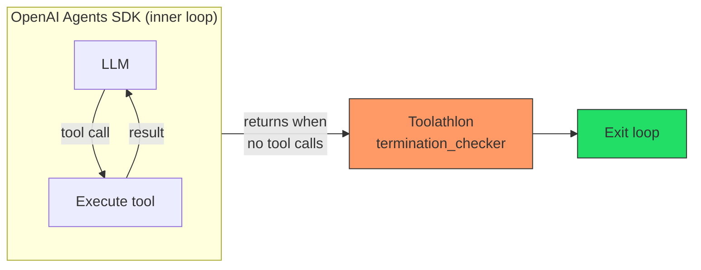
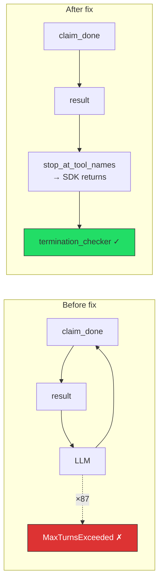

# Known Issues & Mitigations

Reference for anyone running Toolathlon evaluations with non-default models or endpoints. Each issue includes symptoms, root cause, fix, and affected models.

## Summary

| # | Issue | Affects | Status |
|---|-------|---------|--------|
| 1 | [422 — vLLM requires `content` field](#issue-1-422-error--vllm-requires-content-field-on-assistant-messages) | vLLM endpoints | Fixed |
| 2 | [Permission denied on dump files](#issue-2-permission-denied-on-dump-files-decoupled-runner-only) | Decoupled runner | Fixed |
| 3 | [`enable_thinking` rejected by vLLM](#issue-3-enable_thinking-parameter-rejected-by-vllm) | Qwen3 on vLLM | Workaround (config) |
| 4 | [Extra headers not passed to API](#issue-4-extra-headers-not-passed-to-api-primeintellect-billing) | PrimeIntellect | Workaround (env var) |
| 5 | [Fine-tuned model `<tool_call>` tags](#issue-5-fine-tuned-model-outputs-tool_call-tags-instead-of-native-tool_calls) | Fine-tuned models | Fixed |
| 6 | [Tool call runaway loops](#issue-6-tool-call-runaway-loops-qwen3-models) | Qwen3 (base + FT) | Model issue (unfixable) |
| 7 | [`claim_done` loop](#issue-7-claim_done-loop-fine-tuned-model-specific--fixed) | Fine-tuned Qwen3 | Fixed |
| 8 | [Canvas Postgres crash](#issue-8-canvas-postgres-crashes-after-deploy_containerssh) | All models | Workaround (script) |
| 9 | [Stale eval results](#issue-9-stale-eval-results-from-previous-runs) | All reruns | Workaround (manual cleanup) |
| 10 | [Request counter shows 0](#issue-10-decoupled-runner-request-counter-shows-0) | Decoupled runner | Open (cosmetic) |
| 11 | [NoneType crash on malformed tool calls](#issue-11-early-crash--attributeerror-nonetype-object-has-no-attribute-name) | Fine-tuned models | Fixed |
| 12 | [Runaway loops — same tool 35-82x](#issue-12-runaway-tool-call-loops--same-tool-called-35-82x) | Qwen3 (FT worse) | Model issue (unfixable) |
| 13 | [`cache_control` on empty text blocks](#issue-13-cache_control-cannot-be-set-for-empty-text-blocks-anthropic-api) | Claude via Anthropic | Fixed |
| 14 | [Portkey gateway routing error](#issue-14-portkey-gateway--x-portkey-provider-needs-to-be-passed) | Portkey-routed models | Workaround (config) |
| 15 | [`run_parallel.sh` overrides config step limit](#issue-15-run_parallelsh-overrides-config-step-limit-to-100) | All parallel runs | Documented (by design) |

---

## Issue 1: 422 Error — vLLM requires `content` field on assistant messages

**Affected:** Any model served via vLLM (e.g. PrimeIntellect, self-hosted vLLM)
**Not affected:** Anthropic API, OpenAI API

**Symptoms:**
```
Error code: 422 - {'detail': [{'type': 'missing', 'loc': ['body', 'messages', 2, 'content'],
'msg': 'Field required', 'input': {'role': 'assistant', 'tool_calls': [...]}}]}
```
Tasks crash after the first tool call. `eval_res.json` shows `pass: null` with `status: failed`.

**Root cause:** The OpenAI spec allows `content: null` on assistant messages that have `tool_calls`. vLLM's endpoint strictly requires `content` to be present, even if empty.

**Fix:** Two changes in `utils/api_model/model_provider.py`:
1. `ensure_assistant_message()` (~line 190): Initialize `content = ""`
2. Response output message conversion (~line 288): Set `content = ""` when no text segments exist

**Verification:** Run a smoke test with tool calls. If you see 422 errors in `run.log`, the fix isn't active. The fix only takes effect in the **decoupled** runner (agent runs on host). The containerized runner uses code baked into the Docker image.

---

## Issue 2: Permission denied on dump files (decoupled runner only)

**Affected:** Decoupled runner (`run_single_decoupled.sh`)
**Not affected:** Containerized runner

**Symptoms:**
```
PermissionError: [Errno 13] Permission denied: './dumps/model/finalpool/task/status.json'
```
Tasks show `pass: null` with `status: failed`. The agent never runs.

**Root cause:** The container (running as root) creates files during preprocessing. The host-side agent (running as the current user) cannot write to root-owned files.

**Fix:** Added in `scripts/run_single_decoupled.sh` after preprocessing:
```bash
if [ -d "$output_folder" ]; then
    sudo chown -R "$(id -u):$(id -g)" "$output_folder" 2>/dev/null || true
fi
```

**Manual fix for existing files:**
```bash
sudo chown -R $(id -u):$(id -g) dumps/my-model/finalpool
```

---

## Issue 3: `enable_thinking` parameter rejected by vLLM

**Affected:** Qwen3 models on vLLM-based endpoints (e.g. PrimeIntellect)

**Symptoms:**
```
Error code: 400 - {'error': {'message': 'Unsupported parameter(s): `enable_thinking`'}}
```

**Root cause:** vLLM expects thinking mode to be controlled via `chat_template_kwargs`, not as a top-level parameter.

**Fix:** In your eval config JSON, use:
```json
"extra_body": {
    "chat_template_kwargs": {"enable_thinking": false}
}
```

Do NOT use:
```json
"extra_body": {
    "enable_thinking": false
}
```

---

## Issue 4: Extra headers not passed to API (PrimeIntellect billing)

**Affected:** PrimeIntellect endpoint (requires `X-Prime-Team-ID`)

**Symptoms:**
```
{'error': {'message': 'Insufficient balance (including overdraft).'}}
```
The API rejects requests despite having credits because the team ID header is missing.

**Fix:** Set the environment variable before running:
```bash
export TOOLATHLON_OPENAI_EXTRA_HEADERS='{"X-Prime-Team-ID": "'$PRIME_HEADER_ID'"}'
```

The `unified` model provider in `model_provider.py` reads `TOOLATHLON_OPENAI_EXTRA_HEADERS` (JSON string) and passes it as `default_headers` to the OpenAI client.

---

## Issue 5: Fine-tuned model outputs `<tool_call>` tags instead of native `tool_calls`

**Affected:** Fine-tuned Qwen3 checkpoints (e.g. `Qwen/Qwen3-30B-A3B-Instruct-2507:<checkpoint>`)
**Not affected:** Base instruct models

**Symptoms:** The model "works" but tool calls don't execute. The trajectory shows the model generating text with `<tool_call>` XML tags but no actual tool execution.

**Root cause:** Fine-tuning trained the model to emit tool calls in Hermes text format rather than using the native function calling mechanism:
```
Base:       content=null,   tool_calls=[{name: "get_weather", ...}]
Fine-tuned: content="<tool_call>{...}</tool_call>",  tool_calls=null
```

**Fix:** `utils/api_model/hermes_tool_parser.py` (new file) parses `<tool_call>` tags from content and converts them to proper `ResponseFunctionToolCall` objects. Integrated at `model_provider.py:124` — runs automatically when `tool_calls` is empty but content contains `<tool_call>` tags.

**Verification:** Check the trajectory log. If assistant messages have `tool_calls` populated and `content` doesn't contain raw `<tool_call>` tags, the parser is working.

---

## Issue 6: Tool call runaway loops (Qwen3 models)

**Affected:** Qwen3-30B base instruct and fine-tuned
**Not affected:** Claude Opus

**Symptoms:**
- `eval_res.json`: `pass: null`, `details: "Task status: failed"`
- `traj_log.json`: `tool_calls: ~100`, one tool called 80-97 times
- `run.log`: `RuntimeError: Failed to get agent response within 100 inner steps`

**Root cause:** The model gets stuck calling the same tool repeatedly without reassessing its approach. Each call returns the same (often null) result, but the model keeps trying. It exhausts the `max_inner_steps=100` budget without completing the task.

**Comparison with Claude Opus on `stock-build-position`:**
```
Opus:  7 LLM calls, 23 tool calls → success
       Calls get_stock_info a few times, reads results, adjusts approach.

Qwen:  ~100 LLM calls, 100 tool calls → failed
       Calls get_stock_info 93 times, gets null each time, never stops.
```

**Affected tasks (base Qwen3-30B):** `courses-ta-hws`, `dataset-license-issue`, `k8s-redis-helm-upgrade`, `latex-prompt-box`, `personal-website-construct`, `stock-build-position`, `sync-todo-to-readme`, `task-tracker`, `train-ticket-plan`, `verl-dataset`

**Mitigations:**
- Increase `max_inner_steps` (masks the problem, doesn't fix it)
- Test with `enable_thinking: true` (reasoning might help the model break out of loops)
- Count these as failures for scoring purposes

---

## Issue 7: `claim_done` loop (fine-tuned model specific) — FIXED

**Affected:** Fine-tuned Qwen3 checkpoint
**Not affected:** Base instruct models, Claude Opus

**Symptoms:** Same as Issue 6, but the repeated tool is `gw-local-claim_done` (called 79-87 times). The model believes the task is complete but can't stop.

**Root cause — timing mismatch between SDK and termination checker:**

Agent execution has two nested loops. Toolathlon's `termination_checker` (outer) only fires after the OpenAI Agents SDK (inner) returns. The SDK only returns when the model produces a turn with **no tool calls**. If the model keeps calling `claim_done`, the SDK loops internally and never returns:



The base instruct model naturally generates a text-only summary after `claim_done` (no tool calls), which lets the SDK return. The fine-tuned model was not trained to do this — it calls `claim_done` again, trapping itself in the SDK's inner loop.

**How Issue 6 (general runaway) differs from Issue 7 (`claim_done` loop):**

| | Issue 6: General Runaway | Issue 7: `claim_done` Loop |
|---|---|---|
| **What loops** | A regular task tool (e.g. `get_stock_info`) | The stop tool (`claim_done`) |
| **Is task work done?** | No — model never completed the task | Yes — model finished, just can't exit |
| **Fixable in code?** | No — model must learn to adapt | **Yes** — SDK can stop on `claim_done` |

**Fix:** Added `tool_use_behavior={"stop_at_tool_names": stop_tool_names}` to the `Agent()` constructor in `utils/roles/task_agent.py:setup_agent()`. This uses the OpenAI Agents SDK's built-in mechanism to treat `claim_done` as a final-output tool — the SDK stops immediately after executing it, instead of sending the result back to the model for another turn.



The `stop_tool_names` list is sourced from `task_config.stop.tool_names`, which already contains `local-claim_done` (containerized mode) and is expanded to include `gw-local-claim_done` (decoupled mode).

**Impact on other models:** None. For models that already stop correctly (Opus, base Qwen), the only difference is the SDK exits one LLM call earlier — it skips the post-`claim_done` text summary. This is a no-op for evaluation because:
- Task status (`SUCCESS`/`FAILED`) is determined by whether the loop exits cleanly, not by the final text
- Evaluators check workspace artifacts (files, API state), not conversation text
- The `claim_done` tool call and its result are still recorded in the trajectory

**Verified:** Reran `git-milestone` after the fix — went from `pass: null` (100 claim_done loops, eval never ran) to `pass: true` (46 tool calls, 12 LLM requests, full trace recorded).

---

## Issue 8: Canvas Postgres crashes after `deploy_containers.sh`

**Affected:** Canvas LMS container — happens on EVERY fresh deploy

**Symptoms:** Canvas API returns `000`. Inside the container: `postgres: FATAL`.

**Root cause:** `deployment/canvas/scripts/setup.sh` runs `supervisorctl restart all` only 5 seconds after container start. Postgres needs ~30 seconds to finish initializing (schema migrations). Restarting mid-initialization crashes it. The script ignores the error (`|| true`) and continues, so user creation silently fails.

**What NOT to do:**
- `docker exec ... su - postgres -c 'initdb ...'` — destroys the database
- Selectively redeploy only Canvas — always run full `deploy_containers.sh`

**What to do — always two steps:**
```bash
# Step 1: Full deploy (Canvas Postgres will crash — this is expected)
bash global_preparation/deploy_containers.sh true

# Step 2: Fix Canvas (waits for Postgres, restarts cleanly, creates 503 users)
bash scripts/fix_canvas_postgres.sh
```

---

## Issue 9: Stale eval results from previous runs

**Affected:** Any re-run of a model evaluation

**Symptoms:** Progress checker shows results from a previous run. The runner skips tasks with `status: success` in `traj_log.json` but stale `eval_res.json` files pollute the progress checker.

**Fix before restarting:**
```bash
# Remove stale eval results (keeps successful tasks from being re-run)
find dumps/my-model/finalpool -name eval_res.json | xargs rm -f

# Also remove stale traj/status files if you want a full fresh run
find dumps/my-model/finalpool -name traj_log.json -o -name status.json | xargs rm -f

# Fix root-owned files
sudo chown -R $(id -u):$(id -g) dumps/my-model/finalpool

# Kill stale containers
docker ps -a --format "{{.Names}}" | grep "toolathlon-finalpool" | xargs docker rm -f
```

---

## Issue 11: Hallucinated tool names — premature exits and SDK crash

**Affected:** All models (Opus, Qwen base, fine-tuned) — any model that calls a tool name not in the registered function map
**Severity:** High — causes premature task exits after 1-7 tool calls out of ~100 possible

**Symptoms:** Task exits almost immediately with `status: success` on an empty workspace → `pass: false`. The model made 1-7 tool calls, hallucinated a non-existent tool name, and the run ended.

### Background: Upstream Authors' Intent

The original Toolathlon authors explicitly addressed this in their paper (Appendix B):

> "(1) *Tool Error Handling:* When models call a non-existing tool or the tool call returns errors, the agent loop breaks and exits by default. **We improve this by giving the errors as observations to the agent**, so that the agent can continue the trajectory to proceed further."

The upstream code (`origin/main`) implements this intent:
- `my_process_model_response`: Creates `ToolRunFunction(function_tool=None)` for unknown tools (does NOT skip)
- `run_single_tool`: Returns `"Tool X not found in agent Y"` as the error observation when `func_tool is None`

However, the upstream code has a **latent crash bug**: `FunctionToolResult(tool=tool_run.function_tool)` passes `None` to the SDK, which crashes at `_check_for_final_output_from_tools` when accessing `.tool.name`. This bug was never triggered in their evaluations because Claude-4.5-Sonnet and GPT-5 rarely hallucinate tool names.

### Root Cause and Fix Evolution

**Stage 1 — Upstream (origin/main):** Correct intent, latent crash bug
- Creates error observation, but `FunctionToolResult(tool=None)` crashes the SDK

**Stage 2 — Fork workaround (committed HEAD):** Fixed crash, introduced regression
- Added `if tool_run.function_tool is not None` filter in `my_execute_function_tool_calls`
- Changed `my_process_model_response` to `continue` (skip) on unknown tools
- **Problem:** Silently drops the tool call result → model receives no response → SDK interprets as task complete → premature exit

**Stage 3 — Current fix (working tree):** Completes upstream intent
- `_make_dummy_tool(name)` creates a minimal `FunctionTool` wrapper
- `FunctionToolResult(tool=dummy_tool)` prevents SDK crash
- Error message `"Tool X not found in agent Y"` reaches the model as an observation
- Model can retry with a valid tool name

### Behavior Comparison

| Approach | What happens | Task outcome |
|----------|-------------|--------------|
| Original SDK (unpatched) | `ModelBehaviorError` raised → task crashes | `pass: null` (inconclusive) |
| Upstream monkey patch (origin/main) | Error observation created → SDK crashes on `None.name` | `pass: null` (crash) |
| Fork workaround (Stage 2) | Tool call silently dropped → premature exit | `pass: false` (fail on empty workspace) |
| **Current fix (Stage 3)** | Error observation returned to model → model retries | Model gets a fair chance to recover |

### Affected Tasks (FT v2 Run)

| Task | Hallucinated Tool | Tool Calls | Result | Impact |
|------|-------------------|-----------|--------|--------|
| `personal-website-construct` | `gw-github-get_repository` | 2 | FAIL | Strong candidate to flip |
| `task-tracker` | `gw-github-get_repository` | 2 | FAIL | Strong candidate to flip |
| `sync-todo-to-readme` | `gw-github-list_files` | 1 | FAIL | Strongest candidate (F1=0.975 on pre-existing state) |
| `shopping-helper` | `gw-playwright_with_chunk-browser_list` | 7 | FAIL | Likely to make more progress |
| `canvas-art-quiz` | `gw-canvas-canvas_update_quiz` | 10 | PASS | No change needed (already passed) |
| `canvas-homework-grader-python` | `gw-canvas-canvas_list_submissions` | 43 | FAIL | Unlikely to flip (hit step limit) |

### Benchmarking Fairness Note

This fix is **NOT a model behavior intervention**. It completes the upstream Toolathlon authors' explicitly intended behavior (paper Appendix B). The upstream code already attempts to return errors as observations — our fix simply prevents the SDK crash that blocked this from working. All models benefit equally from this fix.

---

## Issue 12: Runaway tool call loops — same tool called 35-82x

**Affected:** Fine-tuned Qwen3 models (worse than base), base Qwen3 also affected
**Not affected:** Claude Opus

**Symptoms:** Model calls the same tool with identical arguments 35-82 times in a row, hitting `max_inner_steps=100`. Common with: `browser_snapshot_search`, `list_directory`, `kubectl_get`, `hub_repo_details`.

**Root cause:** Training issue — the fine-tuned model retries identical failing tool calls rather than adapting. When a tool returns an error or empty result, the model repeats the exact same call instead of trying a different approach.

**Mitigation considered but removed:** We initially added repetition detection (break after 5 identical consecutive calls) but removed it for benchmarking fairness — it intervenes in model behavior and only affects Qwen models, not Claude Opus. The 100-step `max_inner_steps` limit is the only cutoff, applied equally to all models.

**Note:** The underlying cause is a model training issue. The model retries failing tool calls rather than adapting its approach.

---

## Issue 10: Decoupled runner request counter shows 0

**Affected:** Decoupled runner, all models

**Symptoms:** `traj_log.json` shows `total_requests: 0` even when the model was called many times (visible from 100 assistant messages in the trajectory).

**Root cause:** The request counter in the decoupled runner's host agent loop doesn't track LLM requests correctly. The model IS being called once per assistant message, but the counter isn't incremented.

**Impact:** Misleading for debugging — makes it look like all tool calls came from a single generation when they didn't. Does NOT affect task results or scoring.

**Workaround:** Count assistant messages in the trajectory instead of relying on `total_requests`:
```python
import json
d = json.load(open('dumps/model/finalpool/task/traj_log.json'))
actual_requests = sum(1 for m in d['messages'] if m.get('role') == 'assistant')
```

---

## Issue 13: `cache_control cannot be set for empty text blocks` (Anthropic API)

**Affected:** Claude models via Anthropic API (decoupled runner, after Issue 1 fix was applied)
**Not affected:** OpenAI, vLLM, or any non-Anthropic endpoint

**Symptoms:**
```
Error code: 400 - {'error': {'message': 'anthropic error: messages.38.content.0.text:
cache_control cannot be set for empty text blocks'}}
```
Tasks crash mid-conversation (typically after 18-58 messages). `eval_res.json` shows `pass: null` with `status: failed`. The error is non-recoverable — retries hit the same error 10 times and then the agent loop exits.

**Root cause:** Interaction between two fixes:
1. **Issue 1 fix** added `content = ""` initialization in two places (`ensure_assistant_message()` line 191, response conversion line 289) so vLLM wouldn't reject assistant messages without content.
2. **Prompt caching** (`_add_cache_control_to_messages()` line 408) wraps message content with `cache_control: {type: 'ephemeral'}` for Claude models. It checked `isinstance(content, str)` but NOT for empty strings.

Result: empty `""` content gets wrapped into `{'type': 'text', 'text': '', 'cache_control': {'type': 'ephemeral'}}`, which Anthropic's API rejects.

**Why it's intermittent:** The bug only triggers when an empty-content assistant message lands on a cache breakpoint index (every 20th message, or the last message if < 20 total). Short tasks may never hit it; longer tasks hit it once conversations grow past ~18 messages.

**Fix:** Added empty-string guard in `_add_cache_control_to_messages()` (line 408):
```python
# Before (broken):
if i in indices and isinstance(message.get('content'), str):

# After (fixed):
if i in indices and isinstance(message.get('content'), str) and message['content']:
```

**Impact on `claude-opus-rerun`:** 11 tasks hit this bug. These must be rerun after applying the fix — do NOT patch from other runs, as results should come from the same run configuration.

**How to detect in future runs:** Search run logs for `cache_control cannot be set for empty text blocks`. If any matches appear, the fix has regressed or a new empty-content path was introduced.

```bash
# Check for this bug across all runs
grep -rl "cache_control cannot be set for empty text blocks" dumps/*/finalpool/*/run.log
```

**Prevention:** Any future code that sets `content = ""` on messages must be tested with Claude prompt caching enabled. The cache control method should always skip empty content.

---

## Issue 14: Portkey gateway — `x-portkey-provider needs to be passed`

**Affected:** Any model routed through Portkey (decoupled runner)
**Not affected:** Direct API endpoints, containerized runner

**Symptoms:**
```
Error code: 400 - {'status': 'failure', 'message': 'Either x-portkey-provider needs to be passed.
Or the x-portkey-config header should have a valid config with provider details in it.'}
```
All tasks fail immediately with 0 tool calls. `eval_res.json` shows `pass: null`.

**Root cause:** Portkey needs to know which backend provider to route to. This can be specified via:
1. `x-portkey-provider` header, OR
2. `@provider/` prefix in the model name (e.g. `@anthropic/claude-opus-4-6`)

Using a bare model name like `claude-opus-4-6` gives Portkey no routing information.

**Correct setup for decoupled runs through Portkey:**
```bash
# Env vars (must be exported in every new tmux session)
export TOOLATHLON_OPENAI_BASE_URL="https://api.portkey.ai/v1"
export TOOLATHLON_OPENAI_API_KEY="$PORTKEY_API_KEY"

# Model name MUST include @anthropic/ prefix
bash scripts/run_parallel.sh @anthropic/claude-opus-4-6 ./dumps/claude-opus-rerun ...
```

**Common mistakes:**
1. Using `TOOLATHLON_OPENAI_API_KEY="dummy"` with extra headers — doesn't work reliably
2. Using bare `claude-opus-4-6` without `@anthropic/` prefix
3. Forgetting to export env vars in a new tmux session (`.env` is NOT auto-loaded)

**How the original containerized run worked:** The containerized runner baked env vars into the Docker container at launch time via `-e` flags in `run_single_decoupled.sh`. The decoupled runner's host agent loop reads env vars from the shell directly.

**Verification:**
```bash
# Quick curl test before launching a run
curl -s "https://api.portkey.ai/v1/chat/completions" \
  -H "Content-Type: application/json" \
  -H "Authorization: Bearer $PORTKEY_API_KEY" \
  -d '{"model": "@anthropic/claude-opus-4-6", "messages": [{"role":"user","content":"hi"}], "max_tokens": 5}'
```

---

## Issue 15: `run_parallel.sh` overrides config step limit to 100

**Affected:** All models run via `run_parallel.sh`
**Not affected:** Single-task runs via `run_single_containerized.sh` or `run_single_decoupled.sh` with explicit `maxstep` argument

**Symptoms:** Model hits `RuntimeError: Failed to get agent response within 100 inner steps` even though the eval config JSON specifies `max_steps_under_single_turn_mode: 200`.

**Root cause:** `run_parallel.sh` hardcodes `MAX_STEPS="100"` (line ~23) and passes it to the per-task runner as `--maxstep $MAX_STEPS`. The per-task runner passes it to `main.py` as `--max_steps_under_single_turn_mode 100`. In `main.py` (lines 54-55), the CLI argument overrides the config file value:

```python
if args.max_steps_under_single_turn_mode is not None:
    eval_config_dict['global_task_config']['max_steps_under_single_turn_mode'] = args.max_steps_under_single_turn_mode
```

**Impact:** All parallel evaluation runs (Claude Opus, Qwen3-30B base, Qwen3-30B FT v1, Qwen3-30B FT v2) use an effective limit of **100 steps**, not 200. This is consistent across all models, so comparisons are fair. Confirmed by checking Opus run logs: `total: 5/100`.

**To change the limit:** Edit `MAX_STEPS` in `run_parallel.sh`, or pass a custom config and modify the runner to not override it. Note that increasing the limit will increase runtime and API costs for models that get stuck in loops.

**This is by design** — the parallel runner uses a conservative step limit for cost control. The config file's `max_steps_under_single_turn_mode` only takes effect for single-task runs where `--max_steps_under_single_turn_mode` is not passed on the CLI.
